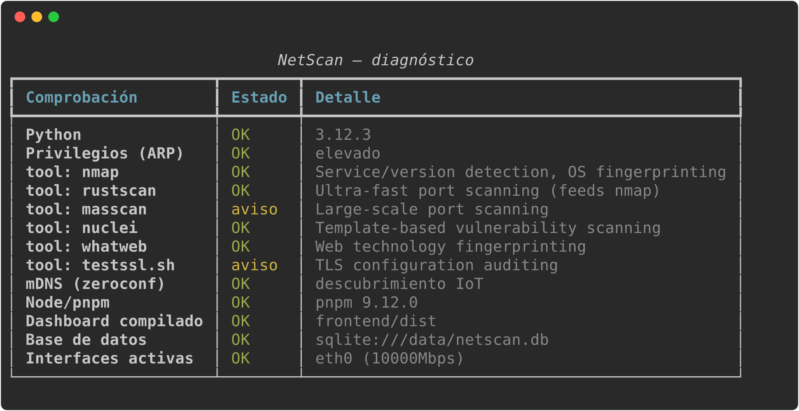

# NetScan — Homelab Network & Systems Monitor

[](https://github.com/abarriuso/netscan/actions/workflows/ci.yml)
[](LICENSE)
[](https://www.python.org/)

Escáner de red, inventario vivo y panel de monitorización para homelabs, con
integraciones configurables desde la propia web para **Proxmox VE**,
**TrueNAS**, **AdGuard Home**, **Pi-hole** y cualquier servicio propio
(marcador con logo personalizado).

> Del escaneo puntual al vigilante permanente: descubre tu red, detecta
> intrusos, vigila tus hipervisores y tu NAS — todo en un solo dashboard.

## Capturas

El dashboard (`http://localhost:8600`) reúne seis vistas:

- **En vivo** — latencia de red en tiempo real y mapa de equipos (online/offline).
- **Resumen** — KPIs, estado del sistema, inventario de dispositivos y alertas.
- **Dispositivos** — inventario detallado con latencia, jitter, pérdida, calidad,
  puertos abiertos y confianza; columnas ordenables y IP/MAC copiables al clic.
- **Analítica** — series de latencia/calidad/throughput, top vendors/SO/puertos,
  servicios web y hallazgos TLS.
- **Integraciones** — Proxmox/TrueNAS/AdGuard/Pi-hole y marcadores propios,
  configurables desde la web.
- **Sistema** — recursos del host (CPU, memoria, discos, red) y estado del
  servidor NetScan.

`netscan.sh doctor` / `netscan.bat doctor` — diagnóstico de un vistazo antes de arrancar:

<p align="center">
  
</p>

```
┌────────────────────────────────────────────────────────────────┐
│  backend/   Python 3.11+ · FastAPI · SQLite · scapy            │
│  frontend/  React 19 · TypeScript · Vite · Tailwind · shadcn   │
│  CI/CD      GitHub Actions (lint · mypy · pytest · build)      │
│  Licencia   GPL-2.0-or-later                                   │
└────────────────────────────────────────────────────────────────┘
```

## Instalación en un comando

**Windows:**

```bat
install.bat --run
```

**Linux / macOS / WSL:**

```bash
chmod +x install.sh netscan.sh && ./install.sh --run
```

Cada uno hace TODO: comprueba/instala Python y Node si faltan, crea el
entorno virtual, instala el backend, las herramientas externas que puede
(`nmap`, `RustScan`, `nuclei`…), compila el dashboard y lo arranca —
`http://localhost:8600` se abre solo. No hay un segundo paso manual. Detalle
completo, opciones (`--minimal`, `--system`, instalador de Windows,
Docker, WSL con las 6 herramientas) en [Arranque rápido](#arranque-rápido-un-solo-comando).

## Qué hace

**Descubrimiento y fingerprinting**
- ARP scan (scapy) con lookup de vendor por OUI
- mDNS/Bonjour (zeroconf) para nombrar IoT que no responden a DNS inverso
- Escaneo de puertos multihilo + heurística de OS
- Fingerprint HTTP/TLS de las web UIs: título, `Server`, emisor del
  certificado, caducidad y autofirmados
- Integración opcional de herramientas externas con **detección automática y
  degradación elegante**: `nmap -sV` para versiones reales de servicio,
  RustScan, nuclei, whatweb, testssl.sh (ver [Licencias](#licencias))

**Inventario vivo (SQLite)**
- Cada escaneo se compara con el inventario persistido
- Alertas de **dispositivo nuevo** (detección de intrusos casera), cambio de
  IP↔MAC y dispositivo caído
- Marca dispositivos como "de confianza" desde el dashboard
- Notificaciones vía Apprise: ntfy, Telegram, Discord y +80 servicios

**Integraciones homelab**
- **Proxmox VE** (múltiples nodos/clusters): estado de nodos, VMs y CTs
- **TrueNAS** CORE/SCALE: pools, discos, SMART, alertas del sistema
- **AdGuard Home** y **Pi-hole** (API v6): consultas DNS, bloqueos, clientes
  (cruzable con el inventario de red)
- Marcadores personalizados para cualquier otro servicio: nombre, URL y
  logo propio, con comprobación de arriba/abajo
- Todo se añade, edita y borra **desde la propia web** — sin tocar
  `netscan.yaml` a mano (las instancias definidas ahí siguen funcionando,
  de solo lectura en el panel)

**Speed test y métricas de calidad (nuevo)**
- Test de velocidad por dispositivo: **latencia** media/mín/máx, **jitter**,
  **pérdida de paquetes**, **tiempo de handshake TCP por puerto** y, opcional,
  **throughput real (Mbps)** por HTTP
- Puntuación de **calidad 0–100** por dispositivo e histórico de muestras
- Botón de speed test bajo demanda en cada fila del dashboard

**Estado del sistema (nuevo)**
- Panel con el estado del **terminal server (backend)** y del **frontend**:
  uptime, peticiones servidas, escaneos, clientes WebSocket, auth, scheduler
- Métricas del host vía `psutil`: CPU (por núcleo), RAM/swap, discos, y
  **tráfico en vivo por interfaz** (↓/↑), con **link speed** del adaptador
- Medidores y contadores **animados** (sin parpadeos; respeta `prefers-reduced-motion`)

**Dashboard**
- Tabla densa de dispositivos con puertos, latencia/jitter/pérdida/calidad,
  tooltips de versión y filtrado
- **Columnas ordenables** (host/IP/latencia/jitter/pérdida/calidad; los valores
  sin dato caen siempre al final) y, en móvil, tarjetas apiladas que conservan
  todas las métricas en vez de ocultar columnas
- **Microinteracciones** en clave terminal: IP/MAC copiables al clic con
  confirmación, respuesta física en botones, tick de columna activa y entrada
  escalonada de filas — todo respeta `prefers-reduced-motion`
- Paneles de Proxmox/TrueNAS/AdGuard/Pi-hole con salud de pools y guests, más
  gestor de integraciones (alta/edición/borrado) y marcadores personalizados
- Progreso de escaneo en vivo por WebSocket, con aviso visible si cae a sondeo HTTP
- Feed de alertas con acknowledge
- Avisos (toasts) con el mensaje real de la API en cada acción (trust, speed
  test, Wake-on-LAN, copiar)

## Arranque rápido — un solo comando

Tras instalar, **`netscan up`** arranca la API **y** el dashboard integrado en
un único proceso y puerto (`http://localhost:8600`) y abre el navegador.

**Windows:**

```bat
install.bat --run
```

Instala Python/Node (vía winget si faltan), crea el venv, instala el backend,
las herramientas externas (nmap, RustScan, nuclei, Npcap), **compila el
dashboard** y con `--run` lo lanza. Luego basta con:

```bat
netscan.bat up            REM  API + dashboard + navegador (auto-elevado)
```

`install.bat --minimal` omite las herramientas externas. Sin argumentos,
`netscan.bat` ya ejecuta `up`.

**Linux / macOS:**

```bash
chmod +x install.sh netscan.sh
./install.sh --run        # instala todo y lanza (o ./install.sh a secas)
./netscan.sh up           # API + dashboard + navegador (se auto-eleva con sudo)
```

`./install.sh` detecta apt/dnf/pacman/brew para las dependencias del sistema y
degrada con elegancia lo que no pueda instalar.

**Instalador de Windows (programa normal):**

```bat
winget install JRSoftware.InnoSetup
iscc packaging\windows\netscan.iss        REM  -> packaging\windows\Output\NetScan-Setup.exe
```

`NetScan-Setup.exe` aparece en "Agregar o quitar programas", crea accesos en
el menú Inicio y deja todo listo. En CI lo compila `installer.yml`
(`workflow_dispatch` o reutilizado por `release.yml`), que también genera el
paquete Linux (`.tar.gz` con backend + `frontend/dist` + `install.sh`) y
adjunta ambos, junto al paquete Python, a cada release de un tag `v*`.

> **¿Una herramienta no aparece como disponible en `netscan doctor` /
> `netscan caps` justo después de instalarla?** En Windows, escribir el PATH
> de usuario no actualiza por sí solo las ventanas ya abiertas ni los accesos
> directos existentes — cierra y reabre la terminal (o el dashboard) antes de
> reportarlo como bug. `install.bat` ya lo hace por ti en la misma ejecución;
> solo afecta a una `netscan.bat`/consola abierta *antes* de instalar.

### Windows con las 6 herramientas — todo lo que ves aquí, funciona

Hay **6 herramientas externas** que NetScan sabe usar: `nmap`, `RustScan`,
`nuclei`, `whatweb`, `testssl.sh` y `masscan` (esta última detectada pero
sin usar todavía). Todas están **conectadas de verdad al motor de escaneo**
— no es solo un indicador visual, cada una hace algo real cuando la lanzas
desde el menú "acciones" del dashboard o desde `netscan scan --full`.

El problema es que **`install.bat` (Windows nativo) solo puede instalar 3
de las 6**: `nmap`, `RustScan` y `nuclei` tienen forma de instalarse en
Windows (winget, o descarga verificada por SHA256). `whatweb` y
`testssl.sh` **no la tienen** — son herramientas Linux (una gema de Ruby,
un script bash sobre OpenSSL) sin equivalente nativo de Windows. Y
`masscan`, aunque compila en Windows, no tiene paquete winget mantenido, así
que tampoco se instala solo.

**¿Cuál es la solución?** Ejecutar NetScan dentro de **WSL** (Linux dentro
de Windows) en vez del NetScan nativo de Windows. Ahí sí puede instalar las
6. Esto es dos pasos separados — primero WSL, luego NetScan dentro:

**1. Instala WSL (una vez, si no lo tienes ya):**

Abre PowerShell **como administrador** (clic derecho → "Ejecutar como
administrador") y escribe:

```powershell
wsl --install
```

Esto instala Ubuntu por defecto. Si te pide reiniciar el PC, reinicia.
Después de reiniciar (o si no hacía falta), busca **"Ubuntu"** en el menú
de inicio y ábrelo — la primera vez te pedirá crear un usuario y contraseña
de Linux (puedes poner lo que quieras, no tiene que coincidir con tu cuenta
de Windows). Eso ya es tu terminal de Linux, integrada en Windows.

**2. Dentro de esa ventana de Ubuntu, instala las herramientas:**

Copia y pega esto (una línea, luego Enter; te pedirá la contraseña que
acabas de crear):

```bash
sudo apt update && sudo apt install -y whatweb testssl.sh nmap masscan
```

Si `testssl.sh` no aparece disponible en tu versión de Ubuntu (algunas
versiones no lo traen empaquetado), instálalo así en su lugar:

```bash
git clone --depth 1 https://github.com/drwetter/testssl.sh.git ~/testssl.sh
sudo ln -s ~/testssl.sh/testssl.sh /usr/local/bin/testssl.sh
```

**3. Arranca NetScan desde dentro de WSL** (no desde `netscan.bat` — ese es
solo para el NetScan nativo de Windows). Tu disco `C:\` se ve desde WSL en
`/mnt/c/`, así que entras al mismo repo que ya tienes:

```bash
cd /mnt/c/COSAS/PROYECTOS/NETSCAN
./install.sh
./netscan.sh up
```

`./install.sh` instala RustScan y nuclei igual que hace `install.bat` en
Windows (y detecta que `whatweb`/`testssl.sh` ya están, del paso 2), y crea
su propio entorno virtual en `backend/.venv-linux` — **separado** del
`backend/.venv` que usa Windows, aunque sea el mismo checkout de repo visto
desde `/mnt/c/`. Un venv de Windows (`Scripts/python.exe`) y uno de Linux
(`bin/python`) no pueden compartir carpeta sin corromperse mutuamente; por
eso van cada uno en la suya. `./netscan.sh up` arranca la API + el
dashboard. El navegador se abre solo; si no, entra tú a
`http://localhost:8600` — WSL2 comparte red con Windows, así que funciona
igual que si NetScan corriera nativo.

Si `python3 -m venv` falla con `ensurepip is not available` (Ubuntu separa
el módulo `venv` en un paquete aparte), `install.sh` ya lo detecta e
instala automáticamente el paquete que falta (`python3.XX-venv`) y
reintenta — no hace falta nada manual.

**4. Comprueba que las ves todas:**

```bash
./netscan.sh doctor
```

Deberías ver las 6 en verde (o "OK") salvo `masscan`, que aparece detectada
pero el motor todavía no la usa (ver tabla más abajo).

> **Nota importante**: esto son dos NetScan *separados* — el nativo de
> Windows (`netscan.bat`, con 3 herramientas) y el de WSL
> (`netscan.sh`, con las 6). No hace falta desinstalar el de Windows; usa
> el que necesites en cada momento. Si quieres que WSL arranque solo al
> encender el PC, puedes crear una tarea programada de Windows que lance
> `wsl ./netscan.sh up --no-browser`, pero eso ya es opcional.

| Herramienta | Windows nativo (`install.bat`) | WSL (`install.sh`) | ¿El motor la usa? |
|---|---|---|---|
| nmap | ✅ | ✅ | Sí |
| RustScan | ✅ | ✅ | Sí |
| nuclei | ✅ | ✅ | Sí |
| whatweb | ❌ | ✅ | Sí |
| testssl.sh | ❌ | ✅ | Sí |
| masscan | ❌ | ✅ (vía apt) | No — detectada, sin cablear al motor todavía |

### Servicio web en Linux (systemd)

Para dejar NetScan como **servicio web** accesible en la LAN:

```bash
./install.sh --system
```

Esto crea `/etc/netscan/netscan.env` (bind a `0.0.0.0:8600` + **token de API
generado**), instala la unidad `netscan.service` con las capacidades de red
necesarias (`CAP_NET_RAW`) y la arranca. El dashboard queda en
`http://<ip-del-servidor>:8600/`.

```bash
systemctl status netscan        # estado del servicio
journalctl -u netscan -f        # logs en vivo
cat /etc/netscan/netscan.env    # recuperar el token si ya no lo tienes a mano
```

La primera vez que el dashboard hace una petición sin token válido, se abre
solo un diálogo pidiéndolo (guardado luego en el navegador); también puedes
abrirlo cuando quieras con el icono de llave 🔑 del header, por ejemplo para
cambiarlo tras rotar el token.

Manual (sin systemd), como servicio en primer plano:

```bash
NETSCAN_API_HOST=0.0.0.0 NETSCAN_API_TOKEN=mi-token \
  ./netscan.sh up --no-browser --port 8600
```

Otros comandos útiles: `netscan speedtest` (test de velocidad de la red),
`netscan doctor` (diagnóstico completo), `netscan scan --full`.

### Proxmox LXC (un comando desde el host)

Para correr NetScan en su propio contenedor, visible desde toda la LAN,
desde la **shell del host Proxmox** (no dentro de un contenedor):

```bash
curl -fsSLO https://raw.githubusercontent.com/abarriuso/netscan/main/packaging/proxmox/create-lxc.sh
curl -fsSLO https://raw.githubusercontent.com/abarriuso/netscan/main/packaging/proxmox/bootstrap-lxc.sh
chmod +x create-lxc.sh
./create-lxc.sh
```

(`bootstrap-lxc.sh` tiene que quedar junto a `create-lxc.sh` — el segundo
lo copia dentro del contenedor nuevo automáticamente; no hace falta
ejecutarlo tú.) Si prefieres no dejar ni esos dos ficheros en el host, hay
un one-liner que no descarga nada permanente — al no encontrar
`bootstrap-lxc.sh` junto a sí mismo, lo baja solo a un temporal en `/tmp`:

```bash
VMID=201 OS_TEMPLATE=ubuntu-26.04-standard bash -c "$(curl -fsSL https://raw.githubusercontent.com/abarriuso/netscan/main/packaging/proxmox/create-lxc.sh)"
```

Y si ya descargaste los dos ficheros y quieres limpiar después,
sea cual sea la forma en que lo ejecutaste:

```bash
rm -f create-lxc.sh bootstrap-lxc.sh
```

Si lo lanzas a mano en una terminal, te pregunta VMID, nombre, plantilla,
bridge e IP uno a uno (Enter para aceptar el valor por defecto que
propone). Cualquiera de esos que ya venga fijado por variable de entorno
no se pregunta; y si no hay una terminal real de por medio (lo lanzas
desde un pipe o algo automatizado), tampoco pregunta nada — usa los
valores por defecto sin más, para no quedarse colgado. Crea un CT sin
privilegiar (**Ubuntu 26.04 LTS** por defecto — cualquier plantilla
Debian/Ubuntu vale, ver `OS_TEMPLATE`; 2 vCPU / **2GB de RAM** — 1GB se
queda corto y el `oom-kill` se lleva por delante al servicio a mitad de
instalación, sobre todo durante el build del dashboard), lo arranca,
clona el repo dentro y ejecuta `install.sh --system` — al terminar
imprime la URL del dashboard y dónde está el token. Todo se puede
ajustar también por variable de entorno (`VMID`, `CT_NAME`, `BRIDGE`,
`IP`, `CORES`, `MEMORY_MB`, `OS_TEMPLATE`, ...); ver los comentarios de
cabecera de `packaging/proxmox/create-lxc.sh` para el detalle completo.
Por ejemplo, para usar Debian 12 en vez de Ubuntu sin que te pregunte
nada:

```bash
OS_TEMPLATE=debian-12-standard ./create-lxc.sh
```

Todo el proceso es desatendido de verdad: `install.sh`/`bootstrap-lxc.sh`
ya silencian el diálogo interactivo de `needrestart` que trae Debian/Ubuntu
(sin eso, un `apt-get install` de en medio se queda colgado para siempre
sin dar ningún error, esperando una tecla que nunca llega por `pct exec`),
e instalan Node.js 20+ solos si el contenedor no lo trae (una plantilla
LXC pelada nunca lo trae) para poder compilar el dashboard.

**El único ajuste que de verdad importa:** `BRIDGE` (por defecto `vmbr0`)
tiene que ser un bridge conectado a tu LAN física, no NAT ni una zona SDN
aislada — el escaneo ARP solo descubre lo que está en su mismo segmento
L2. Eso se decide al crear el contenedor; no hay forma de arreglarlo desde
dentro después.

Si ya tienes un CT/VM Linux creado (con red bien conectada) y solo quieres
la parte de instalación, basta con `bootstrap-lxc.sh` a solas, ejecutado
como root dentro del contenedor:

```bash
curl -fsSL https://raw.githubusercontent.com/abarriuso/netscan/main/packaging/proxmox/bootstrap-lxc.sh | bash
```

### Docker

```bash
cp netscan.example.yaml netscan.yaml
docker compose up --build
# API en :8600, dashboard en :8601
```

## Configuración

Toda la configuración vive en `netscan.yaml` (ver `netscan.example.yaml`) y
puede sobreescribirse con variables de entorno `NETSCAN_*`:

```bash
NETSCAN_PROXMOX__0__TOKEN_SECRET=xxxx   # secreto del token de pve1
NETSCAN_TRUENAS__0__API_KEY=xxxx
NETSCAN_NOTIFY_URLS__0=ntfy://ntfy.sh/mi-topic
```

**Nunca** subas secretos al repo: el YAML está git-ignored solo si lo nombras
`config.local.yaml`; los secretos deben ir siempre en variables de entorno.

### Credenciales necesarias

| Servicio | Qué crear | Dónde |
|---|---|---|
| Proxmox VE | API Token (`PVEAPIToken`) | Datacenter → Permissions → API Tokens |
| TrueNAS | API Key | UI → Credentials → API Keys |
| AdGuard Home | usuario/contraseña de la web UI | — |
| Pi-hole | contraseña de administrador | — (API v6) |

## API REST (extracto)

| Endpoint | Descripción |
|---|---|
| `POST /api/scans` | Lanza un escaneo (`{"full": true}`) |
| `GET /api/scans/latest` | Último resultado completo |
| `GET /api/scans/progress` · `WS /ws/progress` | Progreso en vivo |
| `GET /api/devices` · `PATCH /api/devices/{mac}` | Inventario y trust |
| `GET /api/alerts` · `POST /api/alerts/{id}/ack` | Alertas |
| `GET /api/integrations/proxmox|truenas|adguard` | Salud de integraciones |
| `GET /api/overview` · `GET /api/capabilities` | Resumen y toolchain |
| `GET /api/system` · `GET /api/status` | Estado del server/host/frontend (todo en uno) |
| `GET /api/metrics/summary` | Métricas de calidad agregadas |
| `GET /api/devices/{mac}/metrics` | Histórico de latencia/jitter/calidad |
| `POST /api/devices/{mac}/speedtest` | Speed test bajo demanda de un dispositivo |
| `POST /api/devices/{mac}/wake` | Wake-on-LAN |

Con el dashboard compilado, la API **y** la web se sirven en el mismo puerto
(`/` = dashboard, `/api/...` = API). Docs interactivas en
`http://localhost:8600/docs` (OpenAPI).

### Mensajes de error

Toda respuesta de error de la API llega como JSON `{"detail": "..."}` (con
mensaje en español), y el dashboard muestra ese texto directamente en un aviso
(toast) — nunca un código pelado. Un error inesperado del servidor se captura
de forma global y se convierte en un `500` con `detail` legible; el detalle
técnico (traza) queda en el log de NetScan, no en el cliente.

| Código | Significado | Qué mirar |
|---|---|---|
| `400` | Petición mal formada (ej. rango de red inválido) | Revisa el cuerpo/parámetros de la petición |
| `401` | Falta el token o es incorrecto | Configura el token en el dashboard (icono de llave) o `NETSCAN_API_TOKEN` |
| `403` | Origen no permitido (CORS) | Añade el origen a `NETSCAN_API_CORS_ORIGINS` |
| `404` | Recurso inexistente (ej. aún no hay ningún scan) | Lanza un scan; comprueba la MAC/ruta |
| `409` | Conflicto (ej. ya hay un scan en curso) | Espera a que termine el scan activo |
| `413` | Fichero demasiado grande (ej. logo de integración) | El logo no puede superar 2 MB |
| `415` | Tipo de contenido no soportado | Sube PNG/JPG/SVG para el logo |
| `422` | Validación de campos fallida | El `detail` lista qué campo falla |
| `429` | Demasiadas peticiones | Baja la frecuencia de sondeo o espera |
| `500` | Error interno no controlado | Revisa los logs de NetScan (ver abajo) |

## Resolución de problemas

- **El dashboard carga en blanco / no aparecen datos.** Comprueba que la API
  responde: `curl http://localhost:8600/api/health` debe devolver
  `{"status":"ok"}`. Si no, el servicio no está arrancado (ver systemd abajo).
- **`401` al abrir el dashboard.** Hay un token configurado en el servidor pero
  el navegador no lo tiene. Pulsa el icono de llave en la cabecera e introdúcelo;
  se guarda en el navegador. El token es `NETSCAN_API_TOKEN`.
- **El puerto ya está en uso.** Cambia `NETSCAN_API_PORT` (y `NETSCAN_API_HOST`
  si solo quieres escuchar en localhost). En Linux: `ss -tlnp | grep 8600` para
  ver qué lo ocupa.
- **El escaneo ARP no encuentra dispositivos.** Suele ser permisos o red. El
  escaneo de capa 2 necesita privilegios (en Linux, `cap_net_raw` o root; el
  servicio systemd ya lo concede). En LXC, el contenedor debe estar en modo
  bridge sobre la misma VLAN que quieres escanear.
- **`403` / errores de CORS desde otro equipo.** Añade el origen del navegador
  (ej. `http://192.168.1.50:8601`) a `NETSCAN_API_CORS_ORIGINS` (lista separada
  por comas).
- **Una integración (Proxmox/TrueNAS/AdGuard) sale en rojo.** Verifica URL,
  credenciales y que el destino sea alcanzable desde el host de NetScan. El
  `detail` del error de la integración dice qué falló (DNS, TLS, auth…).
- **¿Dónde están los logs?** En `NETSCAN_DATA_DIR/netscan.log` (además de la
  salida estándar). Con systemd: `journalctl -u netscan -f`.

## Desarrollo

```bash
cd backend
pytest                    # suite completa
ruff check .              # lint
ruff format --check .     # formato
mypy src/netscan          # tipos

cd ../frontend
pnpm lint && pnpm typecheck && pnpm build
```

CI en `.github/workflows/ci.yml`: matriz Ubuntu/Windows × Python 3.11/3.12,
lint+build del frontend, chequeo de licencias de dependencias, auditoría de
vulnerabilidades (`pip-audit` + `pnpm audit`) y releases automáticos al
pushear tags `v*` (backend + instalador Windows + bundle Linux, ver
`release.yml`).

## Estructura

```
├── backend/src/netscan/
│   ├── scanner/        # discovery (ARP), enrich, mDNS, fingerprint, tools, speed, engine
│   ├── db/             # SQLModel: inventario, escaneos, alertas, muestras de métricas
│   ├── integrations/   # proxmox · truenas · adguard
│   ├── api/            # FastAPI + WebSocket + scheduler + estático del dashboard
│   ├── alerts/         # Apprise
│   ├── system.py       # estado del host/proceso/frontend (psutil)
│   ├── config.py       # YAML + env (pydantic-settings)
│   └── cli.py          # typer: up · scan · speedtest · doctor · caps · serve · wake
├── frontend/src/
│   ├── sections/       # Header, StatCards, SystemStatus, DevicesTable, Integrations…
│   ├── components/     # metrics.tsx (número animado, medidor, badge de calidad)
│   ├── hooks/          # polling + WebSocket + animaciones
│   └── lib/api.ts      # cliente REST/WS
├── packaging/
│   ├── windows/        # netscan.iss (Inno Setup → NetScan-Setup.exe)
│   └── linux/          # netscan.service (systemd) · netscan.desktop
├── install.sh · netscan.sh   # instalador y lanzador Linux/macOS
├── install.bat · netscan.bat # instalador y lanzador Windows
├── docker/             # Dockerfile.backend
├── legacy/             # netscan.py original (referencia histórica)
└── .github/workflows/  # CI + release + installer + dependabot
```

## Licencias

NetScan se distribuye bajo **GPL-2.0-or-later** (requerido por scapy,
GPL-2.0-only). Las dependencias importadas son compatibles (MIT/BSD/Apache/
LGPL). Las herramientas GPL/AGPL/NPSL (nmap, RustScan, masscan, nuclei,
whatweb, testssl.sh) **no se distribuyen**: se invocan como procesos externos
cuando están instaladas ("mere aggregation"), y cada función degrada con
elegancia si la herramienta no está presente. Atribución completa en
[NOTICE](NOTICE).

## Contribuir

Ver [CONTRIBUTING.md](docs/CONTRIBUTING.md). Issues y PRs bienvenidos.

---

*English summary: NetScan is a GPL-2.0 homelab network scanner + live
inventory + monitoring dashboard (React/FastAPI) with configurable-from-the-web
Proxmox VE, TrueNAS, AdGuard Home and Pi-hole integrations (plus custom
bookmarks with your own logo), new-device intrusion alerts, mDNS IoT
discovery, TLS fingerprinting and optional nmap/RustScan/nuclei superpowers.
Clone it, `pip install -e backend`, `netscan serve`, and open the dashboard.*
