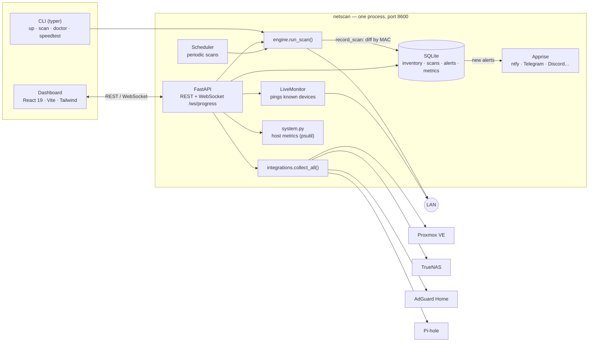
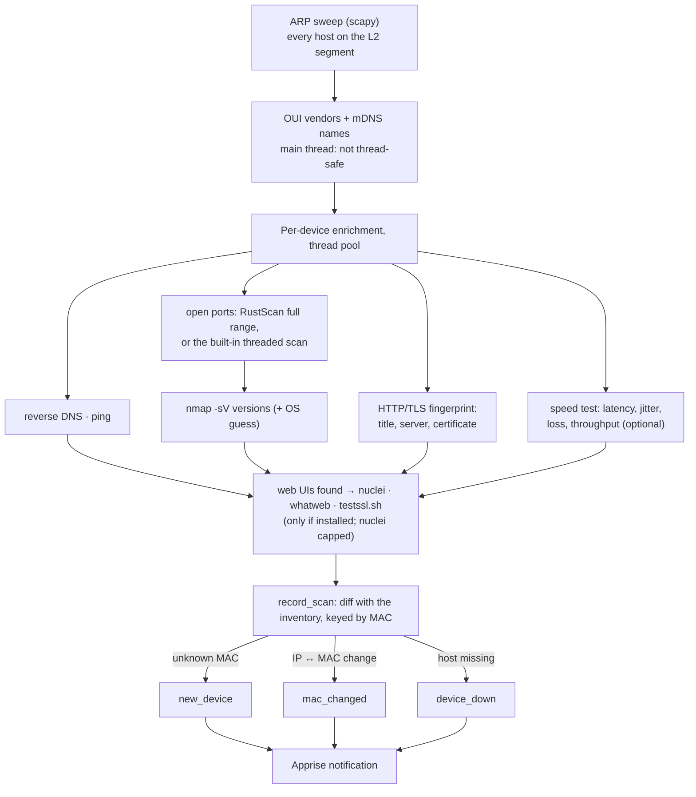

# Architecture

## Overview

### Scan pipeline

## Key decisions

- **A single `engine.run_scan()`** serves both the CLI and the API. Progress is
  reported through a `(stage, done, total)` callback that the CLI draws with
  rich and the API forwards over WebSocket.
- **Non-thread-safe steps on the main thread**: the OUI lookup
  (mac_vendor_lookup) and mDNS are resolved before the thread pool; per-device
  enrichment runs concurrently.
- **Inventory diff by MAC**: the MAC is the stable key; an IP change raises a
  `mac_changed` alert and an unknown MAC a `new_device` one.
- **Optional external tools**: `scanner/tools.py` detects binaries with
  `shutil.which`, exposes `Capabilities` to the API (`/api/capabilities`) and
  each wrapper returns `None`/empty when the tool is missing. Nothing fails
  because nmap is not installed.
- **Fault-tolerant integrations**: `collect_all()` catches any exception per
  instance and returns it as `{"error": ...}` — a Proxmox host that is down does
  not bring the dashboard down.
- **Secrets outside the repository**: pydantic-settings merges YAML + env;
  tokens live in `NETSCAN_*` variables.

## Planned extensions

- SNMP (port 161) through a direct query or nmap NSE scripts.
- Wiring `masscan` into the engine (today it is detected but not used).
